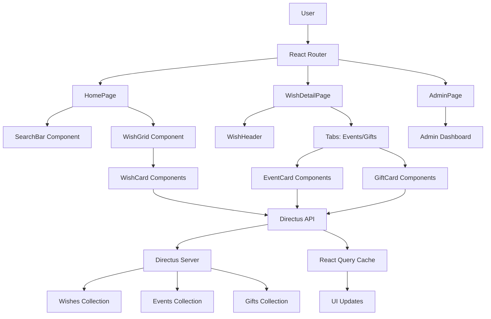

# Deseandola Frontend - Technical Implementation Plan

## Architecture Overview

```
┌─────────────────────────────────────────────────────────────┐
│                    Vite + React + TypeScript                │
├─────────────────────────────────────────────────────────────┤
│  UI Layer                                                   │
│  ├── Components (Reusable)                                  │
│  │   ├── Navbar.tsx                                         │
│  │   ├── SearchBar.tsx                                      │
│  │   ├── WishCard.tsx                                       │
│  │   ├── EventCard.tsx                                      │
│  │   ├── GiftCard.tsx                                       │
│  │   ├── EmptyState.tsx                                     │
│  │   └── Loader.tsx                                         │
│  ├── Pages                                                  │
│  │   ├── HomePage.tsx                                       │
│  │   ├── WishDetailPage.tsx                                 │
│  │   └── AdminPage.tsx                                      │
│  └── Layout                                                 │
│      └── App.tsx                                            │
├─────────────────────────────────────────────────────────────┤
│  Data Layer                                                 │
│  ├── Directus Client (lib/directus.ts)                      │
│  ├── API Layer (features/*/api.ts)                          │
│  └── React Query Hooks (features/*/hooks.ts)                │
├─────────────────────────────────────────────────────────────┤
│  State Management                                           │
│  └── React Query (Server State)                             │
├─────────────────────────────────────────────────────────────┤
│  Routing                                                    │
│  └── React Router (routes/Router.tsx)                       │
├─────────────────────────────────────────────────────────────┤
│  Styling                                                    │
│  └── Tailwind CSS (styles/index.css)                        │
└─────────────────────────────────────────────────────────────┘
```

## Data Flow Diagram



## Implementation Strategy

### Phase 1: Project Setup
1. **Initialize Vite + React + TypeScript**
   - Use `npm create vite@latest . -- --template react-ts`
   - Configure TypeScript strict mode
   - Set up development environment

2. **Configure Dependencies**
   - Install core dependencies: react-router-dom, @tanstack/react-query, @directus/sdk
   - Install dev dependencies: eslint, prettier, tailwindcss
   - Configure package.json scripts

### Phase 2: Core Infrastructure
3. **Project Structure**
   - Create organized folder structure as specified
   - Set up TypeScript configuration files
   - Configure environment variables

4. **Styling System**
   - Initialize Tailwind CSS
   - Configure custom theme (white background, clean typography)
   - Create utility classes for consistent spacing and colors

### Phase 3: Data Layer
5. **Directus Integration**
   - Create Directus client with authentication
   - Implement API layer with proper error handling
   - Set up TypeScript interfaces for all collections

6. **State Management**
   - Configure React Query client
   - Create custom hooks for data fetching
   - Implement caching strategies

### Phase 4: UI Components
7. **Reusable Components**
   - Build atomic components (buttons, inputs, cards)
   - Create composite components (search, grids, tabs)
   - Implement loading and error states

### Phase 5: Pages & Routing
8. **Page Implementation**
   - Home page with search and filters
   - Wish detail page with tabs
   - Admin placeholder page

9. **Routing Setup**
   - Configure React Router
   - Implement route guards for admin area
   - Set up navigation

### Phase 6: Production Readiness
10. **Development Tools**
    - Configure ESLint + Prettier
    - Add React Query DevTools
    - Implement error boundaries

11. **Deployment Configuration**
    - Update Dockerfile for multi-stage build
    - Create nginx.conf for SPA fallback
    - Configure .dockerignore
    - Create environment documentation

## Technical Decisions

### Directus SDK Choice
- **Option 1**: @directus/sdk (REST) - More control, better TypeScript support
- **Option 2**: Fetch with manual typing - Simpler, less dependencies
- **Decision**: Use @directus/sdk for better type safety and maintainability

### State Management
- **React Query**: Server state management with caching
- **Local State**: React useState for UI state (search, filters)
- **No Redux**: Keep it simple with React Query + local state

### Styling Approach
- **Tailwind CSS**: Utility-first CSS framework
- **Custom Theme**: Minimal white theme with gray accents
- **Responsive**: Mobile-first design with breakpoints

### Error Handling
- **Error Boundaries**: React error boundaries for UI errors
- **API Errors**: React Query error handling with retry
- **User Feedback**: Toast notifications for errors

## Environment Variables

```bash
# .env.example
VITE_DIRECTUS_URL=https://hoztlat-regalos.6vlrrp.easypanel.host
VITE_DIRECTUS_TOKEN=8CzN175Z3ibcoDZQRnD3v86AkZAcoaeh
```

## Build & Deployment

### Docker Multi-Stage Build
```dockerfile
# Stage 1: Build
FROM node:20-alpine AS builder
WORKDIR /app
COPY package*.json ./
RUN npm ci
COPY . .
RUN npm run build

# Stage 2: Production
FROM nginx:alpine
COPY --from=builder /app/dist /usr/share/nginx/html
COPY nginx.conf /etc/nginx/conf.d/default.conf
EXPOSE 80
```

### Nginx Configuration
```nginx
server {
    listen 80;
    server_name localhost;
    root /usr/share/nginx/html;
    index index.html;

    location / {
        try_files $uri $uri/ /index.html;
    }
}
```

## Quality Assurance

### Code Quality
- **ESLint**: TypeScript + React rules
- **Prettier**: Code formatting
- **TypeScript**: Strict type checking

### Testing Strategy
- **Unit Tests**: Jest + React Testing Library (future enhancement)
- **Integration Tests**: Component testing (future enhancement)
- **E2E Tests**: Playwright (future enhancement)

### Performance Considerations
- **Code Splitting**: React.lazy for route-based splitting
- **Image Optimization**: Next.js Image component (if needed)
- **Bundle Analysis**: webpack-bundle-analyzer

## Security Considerations

- **Environment Variables**: Never commit secrets
- **CORS**: Configure Directus for frontend access
- **Authentication**: Token-based auth with proper headers
- **XSS Prevention**: React's built-in protection